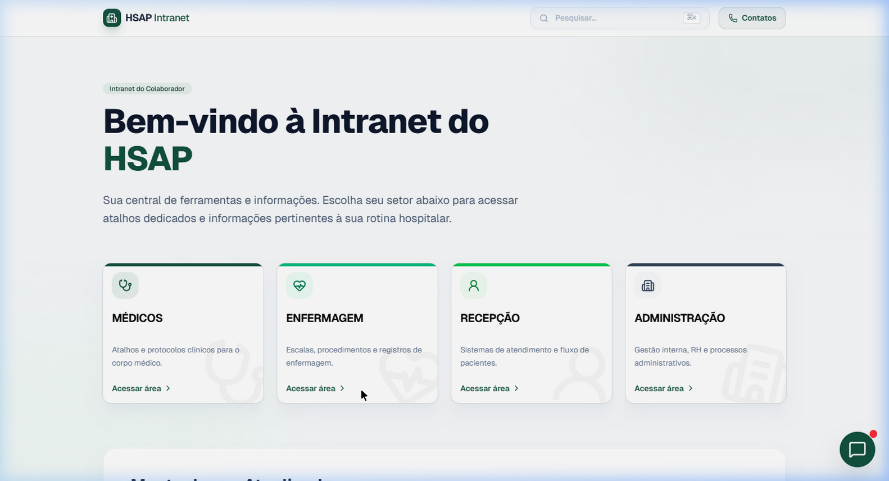
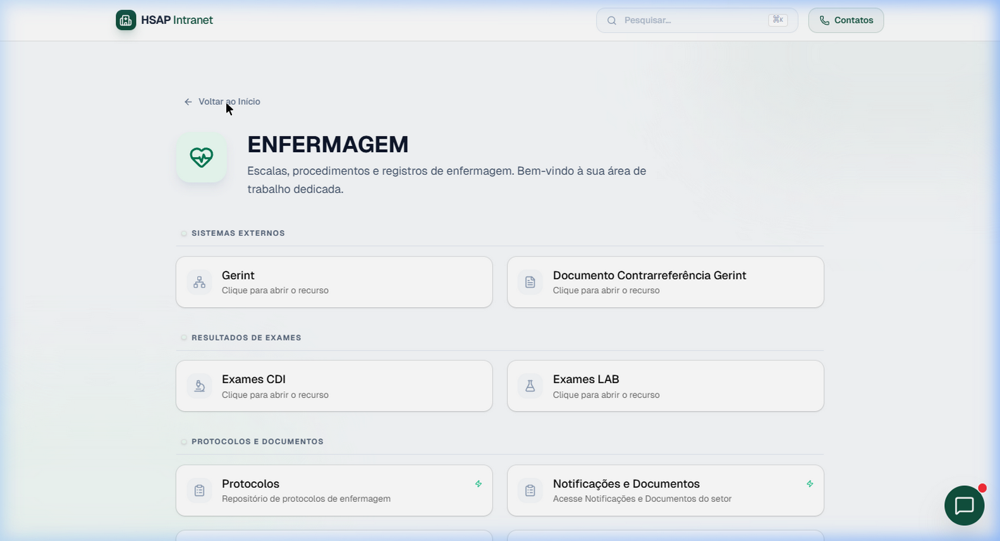
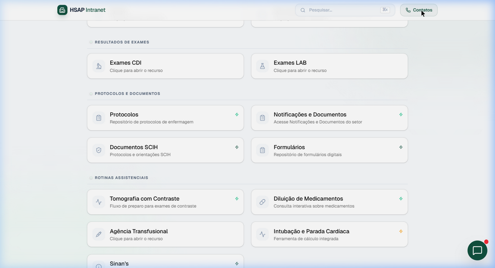

<div align="center">

# 🏥 HSAP Intranet

**Sistema de intranet hospitalar do Hospital Santo Antônio de Pádua**

Plataforma centralizada para acesso a ferramentas, protocolos, documentos e sistemas clínicos utilizados no dia a dia do hospital.

[](https://react.dev/)
[](https://www.typescriptlang.org/)
[](https://tailwindcss.com/)
[](https://vitejs.dev/)
[](https://ai.google.dev/)

</div>

---

## 📸 Screenshots

### Página Inicial
> Tela de boas-vindas com seleção dos setores do hospital.

<div align="center">

</div>

### Área do Setor
> Cada setor possui sua própria página com categorias e atalhos organizados.

<div align="center">

</div>

### Categorias e Ferramentas
> Ferramentas, protocolos e documentos organizados por categoria dentro de cada setor.

<div align="center">

</div>

---

## ✨ Funcionalidades

| Funcionalidade | Descrição |
|---|---|
| 🏠 **Painel por Setor** | Áreas dedicadas para Médicos, Enfermagem, Recepção e Administração |
| 🔍 **Busca Global** | Pesquisa unificada por sistemas, protocolos e setores (`Ctrl+K`) |
| 📞 **Lista de Contatos** | Ramais internos e externos do hospital com busca integrada |
| 🤖 **Assistente IA** | Chat integrado com Gemini AI para suporte ao colaborador |
| 📋 **Protocolos Clínicos** | Manejo de Dengue, Intubação e Parada Cardíaca Pediátrica |
| 💊 **Diluição de Medicamentos** | Consulta interativa sobre diluições e administração |
| 🔬 **Resultados de Exames** | Acesso rápido aos sistemas de CDI e Laboratório |
| 📄 **Documentos SCIH** | Protocolos e orientações da Comissão de Infecção Hospitalar |
| 📝 **Formulários Digitais** | Repositório centralizado de formulários do hospital |
| 📊 **Dashboards** | Painéis de indicadores com acesso protegido por senha |
| 🖨️ **Impressão** | Suporte à impressão de fichas e protocolos em A4 |
| 🔎 **CID-10** | Consulta de códigos CID integrada à plataforma |

---

## 🛠️ Tecnologias

- **Frontend:** React 19 + TypeScript
- **Estilização:** Tailwind CSS 4 + shadcn/ui
- **Animações:** Motion (Framer Motion)
- **Ícones:** Lucide React
- **Backend:** Express.js + Node.js
- **IA:** Google Gemini API
- **Build:** Vite 6
- **Tipografia:** Geist Variable Font

---

## 🚀 Como Executar

### Pré-requisitos

- [Node.js](https://nodejs.org/) (v18 ou superior)
- Chave de API do [Google Gemini](https://ai.google.dev/)

### Instalação

```bash
# Clone o repositório
git clone https://github.com/KaelBittencourt/hsap-Intranet.git

# Acesse o diretório
cd hsap-Intranet

# Instale as dependências
npm install
```

### Configuração

Crie um arquivo `.env.local` na raiz do projeto com sua chave da API:

```env
GEMINI_API_KEY=sua_chave_aqui
```

### Execução

```bash
# Inicie o servidor de desenvolvimento
npm run dev
```

A aplicação estará disponível em `http://localhost:3000`.

### Build para Produção

```bash
# Gera o bundle otimizado
npm run build

# Preview do build
npm run preview
```

---

## 📁 Estrutura do Projeto

```
hsap-Intranet/
├── api/                    # Endpoints da API (chat com Gemini)
├── docs/
│   └── screenshots/        # Screenshots da aplicação
├── src/
│   ├── components/         # Componentes React
│   │   ├── ui/             # Componentes base (shadcn/ui)
│   │   ├── PediatricArrestSheet.tsx
│   │   ├── DengueManagementModal.tsx
│   │   ├── MedicationDilutionModal.tsx
│   │   ├── NursingProtocolsModal.tsx
│   │   ├── AIChatBalloon.tsx
│   │   └── ...
│   ├── lib/                # Utilitários
│   ├── App.tsx             # Componente principal
│   └── index.css           # Estilos globais
├── server.ts               # Servidor Express
├── index.html              # Ponto de entrada HTML
├── vite.config.ts          # Configuração do Vite
└── package.json
```

---

## 📄 Licença

Este projeto é de uso interno do **Hospital Santo Antônio de Pádua**.

---

<div align="center">

Desenvolvido com ❤️ para o **HSAP**

</div>
